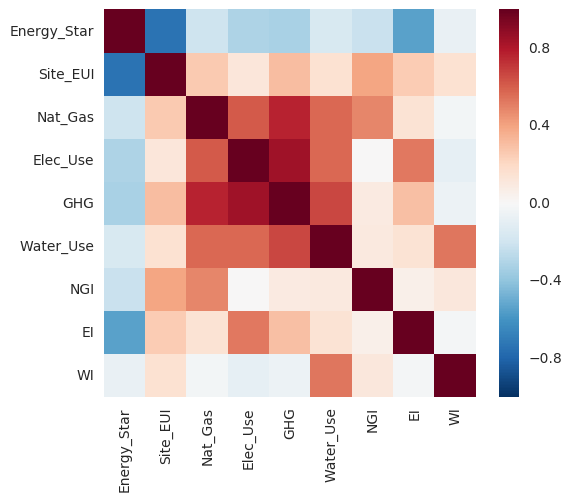

## Introduction

	
The NYC Benchmarking Law requires owners of large buildings to annually measure their energy and water consumption in a process called benchmarking. The law standardizes this process by requiring building owners to enter their annual energy and water use in the U.S. Environmental Protection Agency's (EPA) online tool, ENERGY STAR Portfolio Manager® and use the tool to submit data to the City. This data gives building owners about a building's energy and water consumption compared to similar buildings, and tracks progress year over year to help in energy efficiency planning.

Benchmarking data is also disclosed publicly and can be found <a href="http://www.nyc.gov/html/gbee/html/plan/ll84_scores.shtml">here</a>.  I analyzed the 2016 data and my summary of the findings and recommendations for reducing energy consumption in New York City buildings are discussed below. 

## Requirements
1. <a href="https://www.python.org/"> Python</a> (2.7)
2. <a href="http://jupyter.org/">Jupyter Notebook</a>
3. <a href="http://www.numpy.org/">NumPy</a>
4. <a href="http://matplotlib.org/">matplotlib</a>
5. <a href="http://pandas.pydata.org">Pandas</a>
6. <a href="http://seaborn.pydata.org/">Seaborn</a>

To install the requirements with pip (except for Python), type in the main directory:

	pip install -r requirements.txt 

## Results Summary

### Data 

The 2016 data is very messy and a lot of cleaning was necessary to do analysis on it.  There are about 13,223 buildings recorded in this dataset and many of them have missing data values. The cleaning process was made more difficult because the data was stored as strings with multiple non-numeric values which made converting the data to its proper type a more involved process.

The energy, electricity and water usage as well as emissions data have very large deviations in their values, with most of the buildings having values a small range and then a number outliers that have larger values. For example:

The mean building Energy Usage Intensity (EUI) was 525.73 (kBtu/ft²) with a standard deviation of 10,120.1 (kBtu/ft²).  75% of the buildings have an EUI in the range 0-103 (kBtu/ft²) and the maximum value was 801,504.7 (kBtu/ft²).

### Summary Statistics

The majority of buildings were compliant with the Department of Finance benchmarking requirements. Of those that were not compliant, the only information that was available was the listed address. Some annual mean values across all compliant buildings are,
- The mean ENERGY STAR Score was 57.7 out of 100.
- The mean Site EUI or Energy Usage Intensity was 525.7334 (kBtu/ft²).
- The mean Green House Gase (GHG) Emissions was 6,952.577 (Metric Tons CO2e).
- The mean Electricity Use was 82,014,96.0 (kBtu).
- The mean Natural Gas Use was 2,520,461.0 (kBtu).
- The mean Water Usage was 25,797.51 (kgal).

Below are the distribution of the top 10 most common building types in New York City,

The majority of buildings in New York City are either multifamily housing or office space, of which most were built two decades before or just after World War 2. Multifamily housing or more generally residential buildings have a higher proportion of low Energy Star score buildings when compared to office buildings as seen below,

We note that in the above diagram, the energy star score represents the lower bound on the energy star interval and ther upper bound is one below the next interval's lower bound. For example the (Residential, 10) represents residential buildings with scores between 20 and 34. Since residential buildings have a substantial proportion of lower Energy Star Score buildings and since multifamily housing is the most common building type in New York City these could be the highest return on investment in terms of improving energy efficiency. We analyze the energy/water usage of multifamily housing in New York City below and make recommendations to improve their energy efficiency.

### Multifamily Residential Buildings

Since multifamily housing is the most common building in New York City I decided to annalyze the performance of these buildings and look at the correlation between key features/indicators of their performance.  The abbreviations for these features are:

- <code>Energy_Score</code>: Energy Star Score of building with values between 0 and 100

- <code>Site_EUI</code>: Building Energy Usage Intensity (kBtu/ft²) 

- <code>Nat_Gas</code>: Natural Gas Usage (kBtu) 

- <code>Elec_Use</code>: Electricity Usage (kBtu) 

- <code>GHG</code>: Total Green House Gas Emissions (Metric Tons CO2e)
 
- <code>Water_Use</code>: Water Usage (All Water Sources) (kgal) 

- <code>NGI</code>: Nautral Gas Usage Intensity (kBtu/ft²) 

- <code>EI</code>: Electricty Usage Intensity (kBtu/ft²) 

- <code>WI</code>: Water Usage Intensity (kga/ft²)

Below is a heat map of the correlation matrix of these features for a subset of the buildings that had the most similar characteristics,

We can see that the Energy Star score is negatively correlated with enery usage intensity. This makes sense as the energy star score is a measure of energy efficiceny of the building.  The energy usage intensity has a strong positive correlation to the natural gas usage intensity.  We can see that natural gas usage intensity and electricity usage intensity are uncorrlated.  This implies we could replace one with the other.  Therefore reducing natural gas consumption or replacing it with electricity could be the best answer to reducing energy usage intensity.  It should also be noted that year the residence was built did not have any correlation with energy usage intensity. This is probably due to the fact that the majority of residential buildings in New York City were built in a similar time period and before energy efficiency was a priority.

### Recommendations For Reducing Multfamily Building Energy Usage

Since natural gas usage intensity is most highly correlated with energy usage intensity reducing it could improve building energy efficiency.  Some ways to reduce natural gas consumption include:

- Investing in more efficient heating and cooling services or slightly reducing the usage of either heating or cooling during the day when most people are not home. This is especially important in large buildings as HVAC systems have a larger volume of air to heat/cool.

- Another option is to reuse waste heat, such as reusing the vented air from electric clothes dryers, however, filtering and the air will be necessary and could alter the cost effectiveness of this approach.

- Replacing gas powered appliances such as stoves with more efficient electric ones is another option.  However, the source of electric power should also be considered to weigh the overall energy efficiency and enviromental impact.

- Another option is to replace gas powered water heaters by solar powered water heaters. While solar powered water heaters are not as cost effective in moderate climates, the presence of numerous roof top water tanks on New York City buildings may help make this option more financially competitive.  At the very least, it suggests that having roof top water tanks for solar powered water heaters is structurally possible, where as with individual houses this may not be the feasible.

- In addition, buying energy efficient refrigerators and dryers is also important as these are two of the largest energy consumers in ones home.
 

## Conclusion

With more time I would have like to look into more of the features/indicators of peformance of buildings and their affact on energy efficiency.  I also would have liked to look at the historical data of each building and identify which buildings have been improving and which have not. I would have also like to have mapped out the different properties to see if there are areas or property owners that have particular issues with energy usage intensity or compliance with the Department Of Finance Benchmarking. I think this one be useful in helping to have a more focused approach to finding buildings with the highest ROI on energy efficiency investments.
